# WhereIsMyHome
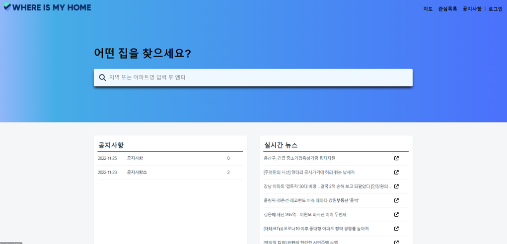

> __햄버거는 맥날__  
윤소현, 박성환 

> __개발 기간__: 2022.11.16 ~ 2022.11.24 (약 1주) 

 

### UCC ➡ [유튜브 링크](https://youtu.be/1zM4mftnxjI)
### 발표자료 ➡ [발표자료 링크](/docs/WhereIsMyHome_Presentation.pdf)
### 백엔드 레포지토리 ➡ [깃허브](https://github.com/sohyeonyun/whereismyhome-backend)

 

--- 

 

## 기획 배경 및 목표
> 이사를 하고자 할 동네에서 원하는 아파트, 주택의 매매 거래 정보 검색
> 아파트 매매 정보를 가지고 Web Project 구현
 

## 기대 효과
- 키워드 검색을 통해 원하는 지역과 아파트를 한 눈에 볼 수 있습니다.
- 원하는 지역의 아파트 매매 정보를 볼 수 있습니다.
- 특정 아파트의 연도별 평균 거래가를 쉽게 볼 수 있습니다.
- 실시간으로 부동산 관련 뉴스를 확인할 수 있습니다.
 
  

## 기술 스택 & 아키텍쳐
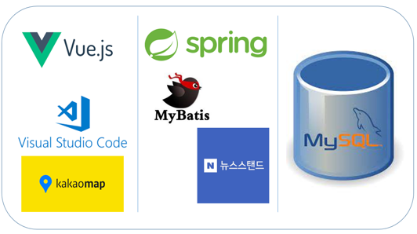
 
 

### Front-End
 `Vue.js`
 `Vuex`

### Back-end
 `Spring Boot`
 `MyBatis`
 `MySQL`
 
### TEAM Cooperation
 `Gitlab`

  
   

--- 

## 서비스 소개 
공공데이터와 검색 기반으로 지역별 아파트 매매 정보를 지도로 한 눈에 파악하기 위한 서비스
1. 지역 또는 아파트 이름으로 검색 기능
2. 로드뷰, 표, 그래프 등 다양한 지표로 아파트 거래 정보 확인
3. 아파트 정보 찜하기 기능
4. 관리자와 사용자 간의 문의하기 기능
5. 공지사항 게시판과 댓글 기능

### 회원 관리
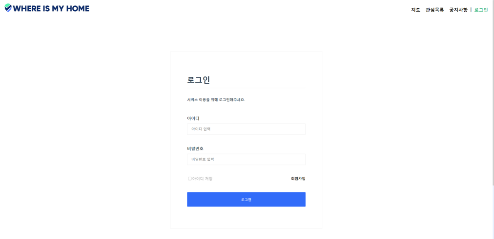
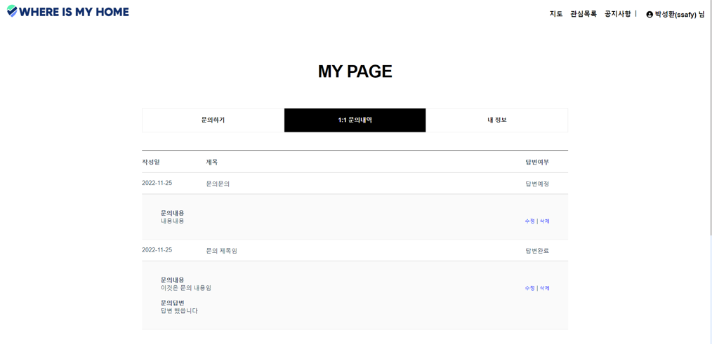
기본적인 회원가입, 로그인, 프로필 수정, 탈퇴가 가능합니다.

### 검색

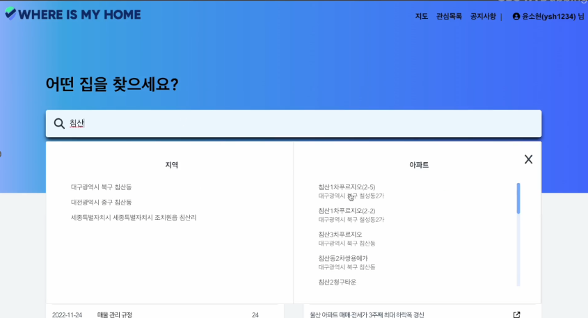
지역과 아파트 이름으로 검색이 가능합니다.

- 검색 결과 클릭 시 지도창으로 바로 이동합니다.

### 지도
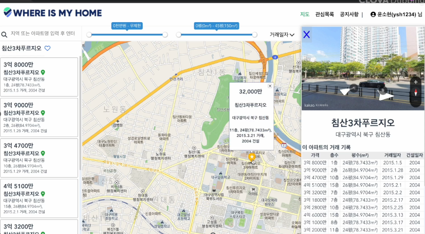
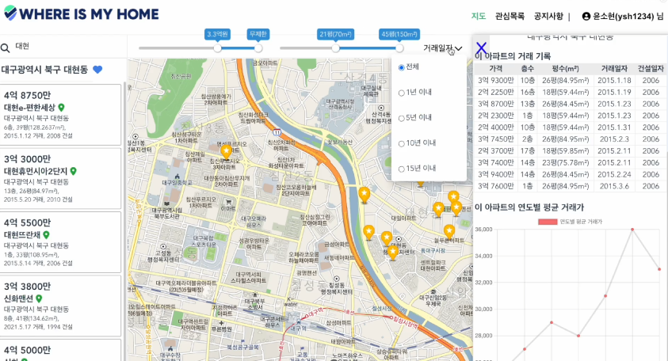
검색 결과에 대해 지도 위에 마커로 표시하고 해당 거래 정보를 상세히 보여줍니다.

- 지역 검색일 경우 해당 지역 내의 아파트 목록에 대해 마커를 표시합니다.
- 아파트 검색일 경우 해당 아파트에 대해 마커를 표시합니다.
- 마커에 해당하는 아파트에 대한 거래 정보를 로드뷰, 표, 그래프로 보여줍니다.

### 지도 내 검색
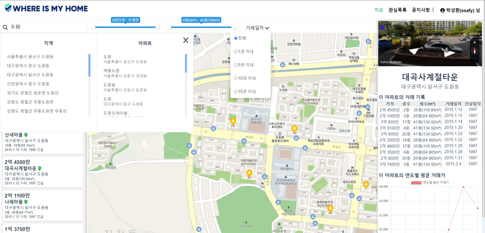

슬라이더 바로 가격, 평수, 기간에 대해 상세 검색이 가능합니다.

### 공지사항
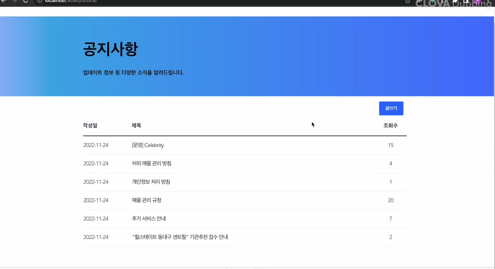
공지사항 게시판에 글을 쓸 수 있습니다. 
수정, 삭제, 댓글 등이 가능합니다.

### 관심 목록
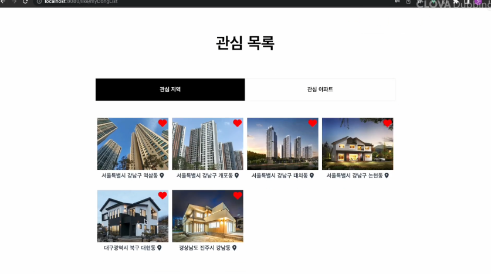
관심 지역이나아파트에 대해 좋아요를 표시할 수 있습니다.

- 클릭 시 지도 페이지로 이동합니다.

  
  

--- 

## ERD
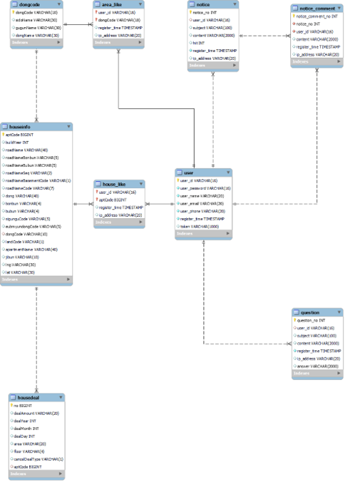
  
  

## 개발 일정
> __개발 기간__: 2022.11.16 ~ 2022.11.24 (약 1주)
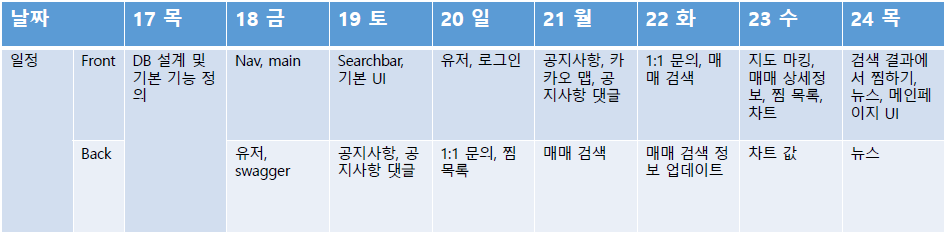
 

## 팀원 역할   
| 이름   | 역할 | 내용                        |
| ------ | ---- | --------------------------- |
| 박성환 | 팀장 | 백앤드 개발, DB 설계 |
| 윤소현 | 팀원 | 프론트엔드 개발, UI/UX디자인 |

## 개발 후기
- 윤소현 : 협업에서 Git이 필수임을 느꼈습니다. 또한 Vue에서 컴포넌트의 단위와 재사용성에 대한 부분에서 어려움을 느꼈는데, 개발 시간이 촉박해 충분히 고민해보지 못한게 아쉽습니다. 기회가 된다면 Git과 컴포넌트 설계에 대해 공부해보고 싶습니다.

- 박성환 : 그동안 다 배운 내용들을 바탕으로 하는 프로젝트지만, 그래도 막상 하나의 프로젝트를 한다고 하니 약간 겁도 났지만 무사히 잘 끝나서 다행인 것 같습니다.

  
